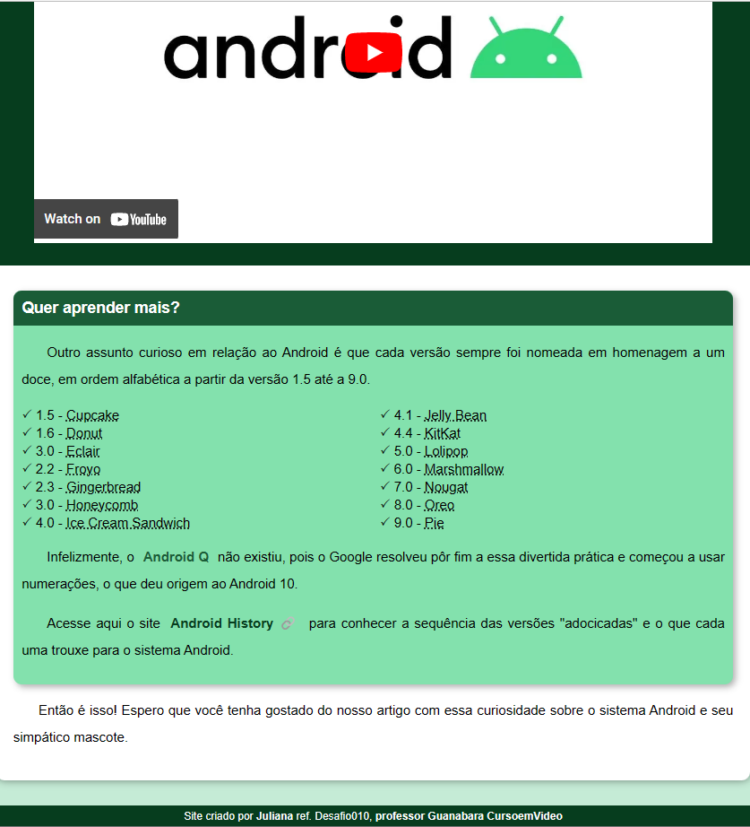

# My First WebPage!

I developed this simple webpage during the course [*Curso em Video*](https://www.youtube.com/playlist?list=PLHz_AreHm4dlUpEXkY1AyVLQGcpSgVF8s), by Teacher [*Gustavo Guanabara*](https://github.com/gustavoguanabara/html-css).

During this course, I could learn and practiced different perspectives of **HTML/CSS**. This project is the final result of my studies and achievements.

## **Observing Responsivity:**

